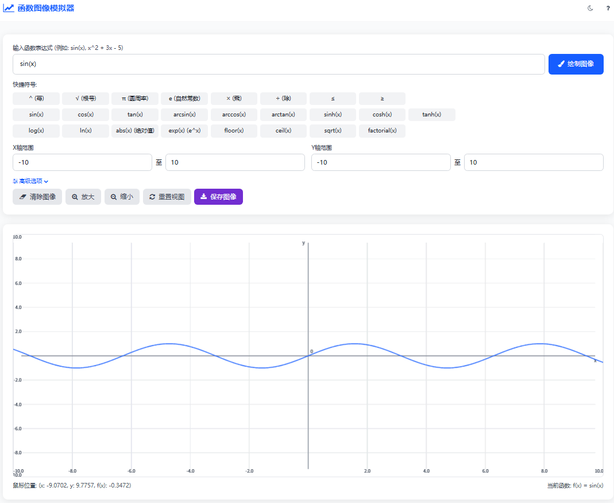

# 函数图像模拟器 README

## 项目简介
函数图像模拟器是一个基于 HTML，由大学生闲时开发的轻量级网页工具，支持绘制多种数学函数图像，适配 PC 端与手机端，可用于学习、教学或数学计算场景。用户可输入自定义函数表达式，调整坐标轴范围、绘图精度与样式，并通过交互功能（缩放、重置、保存）优化使用体验。

程序运行主页截图

## 核心功能
1. **多类型函数支持**
    - 基本运算：`+` `-` `×` `÷` `^`（幂运算）
    - 三角函数：`sin(x)` `cos(x)` `tan(x)` 等
    - 对数函数：`ln(x)`（自然对数）、`log(x)`（常用对数）
    - 特殊函数：`abs(x)`（绝对值）、`sqrt(x)`（根号）、`exp(x)`（指数）等
    - 常数：`π`（圆周率）、`e`（自然常数）

2. **灵活交互控制**
    - 坐标轴范围自定义（X轴/Y轴最小值/最大值）
    - 图像缩放、视图重置、画布清空
    - 绘图精度（点密度）、线条颜色与宽度调整
    - 鼠标悬停显示坐标与函数值，支持图像本地保存（PNG格式）

3. **多设备适配**
    - 响应式布局，兼容 PC 端与手机端浏览器
    - 支持深色/浅色主题切换，优化不同环境下的视觉体验

4. **便捷操作设计**
    - 快捷符号按钮（无需手动输入复杂语法）
    - 预设示例函数（点击直接绘制，快速上手）
    - 自动处理函数定义域（如 `ln(x)` 自动调整 X 轴范围至 `x>0`）

## 使用指南

### 1. 输入函数表达式
- 在顶部输入框中输入函数（如 `x^2 + 3x - 5`、`sin(πx)`、`ln(x+2)`）
- 可点击下方「快捷符号」按钮快速插入特殊符号（如 `π`、`ln(x)`、`sqrt(x)`）
- 输入完成后点击「绘制图像」按钮，或按 `Enter` 键生成图像

### 2. 调整图像参数
- **坐标轴范围**：在「X轴范围」「Y轴范围」区域输入数值，支持小数（如 X 轴 `0.1` 至 `10`，适配 `ln(x)` 定义域）
- **高级选项**：点击「高级选项」展开，可调整：
    - 绘图精度（值越大，图像越平滑，推荐 `1000-5000`）
    - 线条颜色（通过颜色选择器自定义）
    - 线条宽度（1-10 像素，值越大线条越粗）

### 3. 交互操作
- **放大/缩小**：点击「放大」「缩小」按钮，或通过调整坐标轴范围实现精细缩放
- **重置视图**：点击「重置视图」恢复默认坐标轴范围（X：-10~10，Y：-10~10）
- **保存图像**：点击「保存图像」，将当前画布以 PNG 格式下载到本地
- **清除图像**：点击「清除图像」，清空画布（保留坐标轴网格）

### 4. 示例函数
- 页面底部「示例函数」区域提供 9 种常用函数（如正弦函数、二次函数、自然对数）
- 点击任意示例按钮，自动填充函数表达式并绘制图像，适合快速学习与测试

## 常见问题（FAQ）

### Q1：手机端打开提示「找不到 math.js」？
A：解决方案参考「快速开始 - math.js 加载方式」：
1. 优先使用「代码内嵌」方式，消除外部依赖；
2. 若使用 CDN，确保手机联网，并尝试切换 CDN 链接（如将 jsDelivr 替换为 UNPKG：`https://unpkg.com/mathjs@11.8.0/lib/browser/math.min.js`）；
3. 检查浏览器是否禁用 JavaScript（手机浏览器默认启用，隐私模式下需手动开启）。

### Q2：函数绘制失败，提示「函数解析错误」？
A：检查函数表达式格式：
1. 幂运算使用 `^`（如 `x^2` 而非 `x²`）；
2. 函数参数需加括号（如 `sin(x)` 而非 `sin x`）；
3. 乘法需显式写 `×` 或 `*`（如 `2×x` 而非 `2x`）；
4. 对数函数注意定义域（如 `ln(x)` 需 X 轴范围 `>0`，工具会自动调整并提示）。

### Q3：图像显示不全或超出画布？
A：调整坐标轴范围：
1. 若函数值过大（如 `e^x`），增大 Y 轴最大值（如设为 `20`）；
2. 若函数在局部密集（如 `tan(x)`），缩小 X 轴范围（如 `(-π/2, π/2)`）；
3. 提高绘图精度（如设为 `5000`），解决图像断层问题。

### Q4：深色主题切换不生效？
A：刷新页面后重试，或检查浏览器是否支持 CSS 变量（主流浏览器均支持，若使用老旧浏览器，建议升级）。